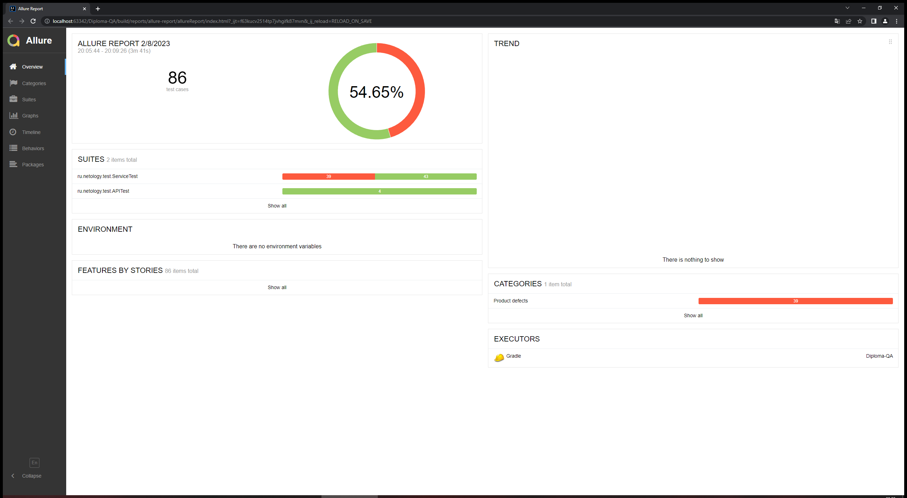
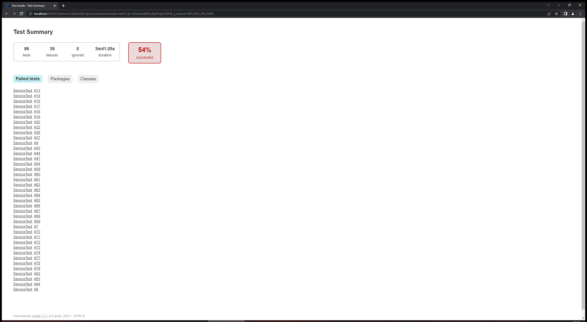

# Итоги тестирования

* Произведено исследовательское тестирование сервиса
* Написание автоматических тестов для сервиса завершено

  * Общее количество тестов - 86;
  * Успешно пройдены - 47 (54.65%);
  * Не пройдены - 39 (23.07%);

### Allure Report

### Gradle Report

### AppVeyor CI
[Отображение](https://ci.appveyor.com/project/crackmajor/diplom-qa?fullLog=true) полного журнала.

### Рекомендации

Полное описание рекомендаций можно найти [тут](https://github.com/crackmajor/DIPLOM-QA/issues)